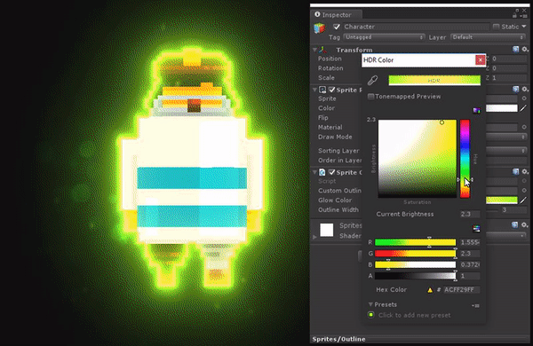

# jzha0529-9103_Quiz-8

## Imaging Technique Inspiration

__Halo (halation) effect__ is a more commonly used imaging technology in digital artworks, it can wrap an object with light to emphasize the visual impact of the object, or shroud the scene with light to show a hazy sense of contrast with other scenes.

__Examples:__

In my project, I can use similar techniques to wrap an object or part of an object with light, or to blur a distant scene with light, both of which can be used in the artwork __'Wheels of fortune'__ and, __'Saint Georges majeur au cre?puscule'__ respectively.

## Coding Technique Exploration

__In Unity (C sharp)__, I found an example of implementing a halo effect on an object:

